Fast-track Sydney, 2021

> ## Link (URL) to your deployed app (i.e. website)

<https://mysite-1sib.onrender.com/>

n.b. My AWS S3 has been expired, Heroku is no longer free, so I have changed some parts to deploy on Render

Expired url: <https://sakura-wedding.herokuapp.com/>

> ## GitHub repository

<https://github.com/Olivia-dang/sakura-wedding>

> ## Project Management - Trello

<https://trello.com/b/wOzMr9ub/wedding-dress-market>

> ## Installation

This project is built on Ruby 2.7.2 and Rails 6.1.3.2.
Make sure you have the correct Ruby and Rails version to run the app properly.

Clone the project from github repo:

```
git clone https://github.com/Olivia-dang/sakura-wedding
cd sakura-wedding
```

Install dependencies in Gemfile

```
bundle install
```

Install packages and project dependencies

```
yarn install --check-files
```

Set up the database and populate with sample data

```
rails db:create
rails db:migrate
rails db:seed
```

Run server

```
rails s
```

> ## R7 Identification of the problem you are trying to solve by building this particular marketplace app

An important day in many women’s lives is their wedding day. A particularly important part of that day is the dress. Women want to have a dress that makes them feel beautiful, and it is a key part in wedding preparation. However, cost is a factor in wedding dress shopping – some cannot afford a brand new dress and some do not want to spend thousands of dollars on a dress that will be worn once. Some people want to sell their wedding dress because it has been in the wardrobe for so long and they will never wear it again. Therefore, the market for second-hand and discounted dresses at affordable prices is very promising.

My interest in creating this site came from personal experience. When my husband and I got married, we decided on a small and intimate ceremony, and I wanted a simple dress to match. When I started shopping for these, I found the cost extremely expensive. Basic dresses were retailing for around $4k, and with more expensive and elaborate designs costing between $10k - $20k. Even to hire one for the day would have cost $1k. I researched second-hand dresses, and found the site stillwhite.com.au, which connects buyers and sellers. However, I felt that the site’s UI was confusing and inconsistent, and they had missed the opportunity of also selling wedding related accessories, or posting other wedding content.
Besides, there may be one or two sponsored content on top. The business should be open to wedding-related outfits and accessories as well, so the customer can look for a veil, for instance, to match with the purchased dress. There should be blogs about wedding's tips, or photo shooting advice...

Another website in the market is jjshouse.com.au, selling both wedding dresses and other formal outfits. The reviews for this site are positive, and the prices are very reasonable. But this (and many similar sites) only allow users to purchase dresses, and do not offer a service where the user can sell their dress.

To address this need in the market, I have created a marketplace website called Sakura Wedding. The name means ‘cherry blossom’ in Japanese, and represents a time of renewal and optimism. This is indicative of the type of brand I want to build for the website, and will also contribute to it’s overall aesthetic design. I would like my website to make the shopping experience easier for women, and to create an area where women can buy and sell wedding dresses at reasonable prices, so everyone can find their dream dress. This also fits with the current trend of sustainability, and less waste. This is a positive brand message that can be used in promoting the site.

I have chosen to sort products by location, so customers can see dresses that are nearby, allowing them to try the dress on in person before committing to buy. The first iteration of this website is simply buying and selling wedding dresses, but there is also opportunity in the future to expand the offering to accessories and shoes as well.

> ## R8 Why is it a problem that needs solving?

The current wedding dress market primarily focuses on new dresses at extremely high prices, which is out of reach for many people. I would like to make wedding dresses more affordable and accessible, and offer discerning customers a sustainable and eco-friendly solution. This site allows users to save money when purchasing their dress, and they are then encouraged to return to the site to make money when selling their dress.

There is also opportunity going forward to extend the range to small businesses to use the site as an online marketplace selling opportunity. This would allow them to take advantage of the in-place site infrastructure and marketing tools, and the site would also have more product lines to attract more customers. They would also be encouraged to keep prices on the site reasonably low, in order to stay competitive with users selling their second hand dresses. Online consumers are familiar with marketplace websites and value a large range of choice over visiting individual stores. With Sakura Wedding Website, I hope it can support SME businesses to grow up as well.

A key part of the website design aims to make it as user friendly as possible. The easy to browse design will allow users to have a longer dwell time on the site, and make it the shopping experience easy and hassle free. The design of the site cards is deliberately uniform in size and structure, and users have the ability to filter by category. Users are also given the opportunity to engage with sellers, and chat to them before committing to a purchase.

> ## R11 Description of your marketplace app

## Purpose

The application is a marketplace where users can buy and/or sell wedding dress(es), whether the wedding dresses are new or used. All payments are made online.

## Functionality/features

'Search' function, Homepage, Contact and About pages are made public. If users want to see more details about any item, check inbox, see account management, make a transaction they have to login or register. Header and footer are the same for all pages.

### 1. Homepage

Provides users with sitemap and list out all dresses.
This page applied user authorisation. If the user is the owner of any dress, they will see button "Edit" and "Delete". If not, they will see button "See more". After clicking "See more", it will be redirected to login page if user has not logged in yet. If this is the first time user, they will have to register an account.

The top left is the links to register or login to an account.
The sitemaps in header and footer links to other pages/functions:

- About: story about people behind the scene, who makes Sakura Wedding a nice marketplace for everyone. However, I didn't have enough time to write a story so I just use Lorem to demo.
- Contact: A form to submit a message to Sakura Wedding by filling a form with name, email, phone number and message. However, this page is just a visual demo and not my focus in this assignment.
- Sell an item: click to quickly list a wedding dress for sale
- My account: Open your account management
- Inbox: Open your inbox section to chat with other users.

### 2. Show a dress

- This page displays information of a dress, showing its name, Category, color, size, description, price, reviews. If you are not the owner of the dress, you will see button "checkout". Click on the checkout to be redirected to Stripe and pay for the dress. I didn't know how to hook the payment result from Stripe back to the the app yet, so for now, I suppose that all transaction is successful and the sold dress will be shown in buyer's purchases history and seller's sales history.
- users can click on seller's `name` or button `See more from this seller` to open the seller's showroom for more dresses from the same seller.

### 3. Sell a dress

- Users can approach this function from the sitemap links (header or footer), a button at the end of all listings (right above the footer), or in their own showroom page. The purpose is that to make it easy for users to list their item.
- Users fill in dress name, choose category of the dress, choose size, fill in color, description, price and attach a picture.

### 4. Buy a dress

- Users have to log in to see dress's details, then click 'Checkout' button to be redirected to payment (Stripe). I suppose that all transactions are successfully paid (because I don't know how to receive successful payment message from payment gateway provider yet. Ultrahook is just to test on localhost, I do not think it works for Heroku server, so I did not use that).

### 5. My account

- This is one of my favourite part of the website. There is a side navigation bar to the left so that users can know where they are easily.
- Account information: this page shows all user information. If users wish to edit those info, they can click the button `Edit account`.
- Purchases history: Show all purchases of this user so far. If they have made a transaction, the dress's information will be shown here, together with seller's username, Order date, and click to the picture to show the dress.
- Sales history: This page is a list of all dresses sold by the user. The structure of this page is the same with Purchases history (I utilised a partial file to store the table structure).
- User's showroom: This page shows all dresses listed by `current_user`.
This page can be accessed by clicking `username's showroom` (e.g. Pikachu's showroom) in Account management page, or when users open a specific dress page, click on the seller `name` /  button `See more from this seller`.

### 6. Inbox

- Users can find this function from the sitemap, or in My Account page (bottom of the sidebar).
- the left part of this page is a list of Contacts. I suppose that all users in this page are 'friends' of this user and they can click the name to chat with each other. `All conversations` is a link to the Inbox with all conversations.
- the right part is `Inbox`, with all on-going conversations. We can see who we are chatting with, and 39 characters of the latest message. To view and/or continue this conversation, just click to it, then users can send a new message.

### 7. Search

Users can type in a whole word or a part of keyword. Search result will find if it it matches any dress name, color or description. Then show them in a table. (The search scope is limited in Dresses data table, I don't know how to search in multi-tables yet)

### 8. Filter

Users can filter dresses by categories. This function can be found in the homepage, `All dresses` section.

### 9. User authentication and authorisation

I used gem Devise for user authentication and Pundit for authorisation. Only owner of the dress can edit and delete the dress. Non-owner will only see "See details" in dress cards in the homepage and "checkout" in the show dress page.

### 10. Review

Users can see and write reviews for a dress (in the show dress page), or reviews for a user in their showroom page.This function is very important in the real business world because it helps the community to know if the seller is good or not, and encourage sellers to improve their service.

## Sitemap

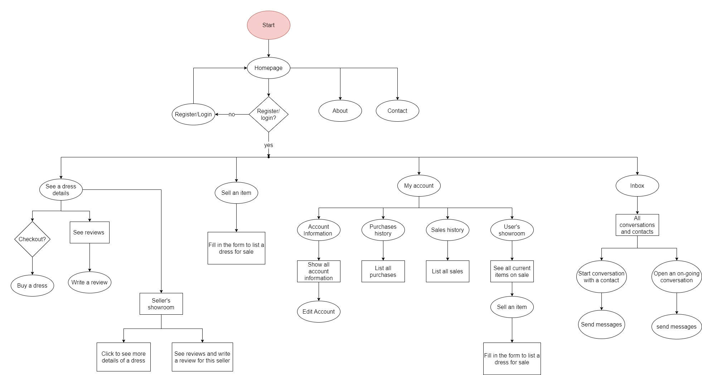

## Screenshots

- ### Homepage

This page applied user authorisation. If you are the owner of any dress, you will see button "Edit" and "Delete". If not, you will see button "See more".
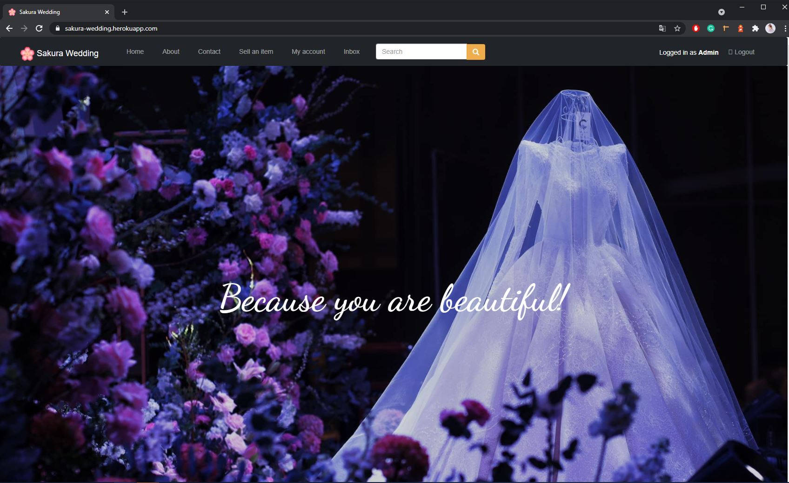
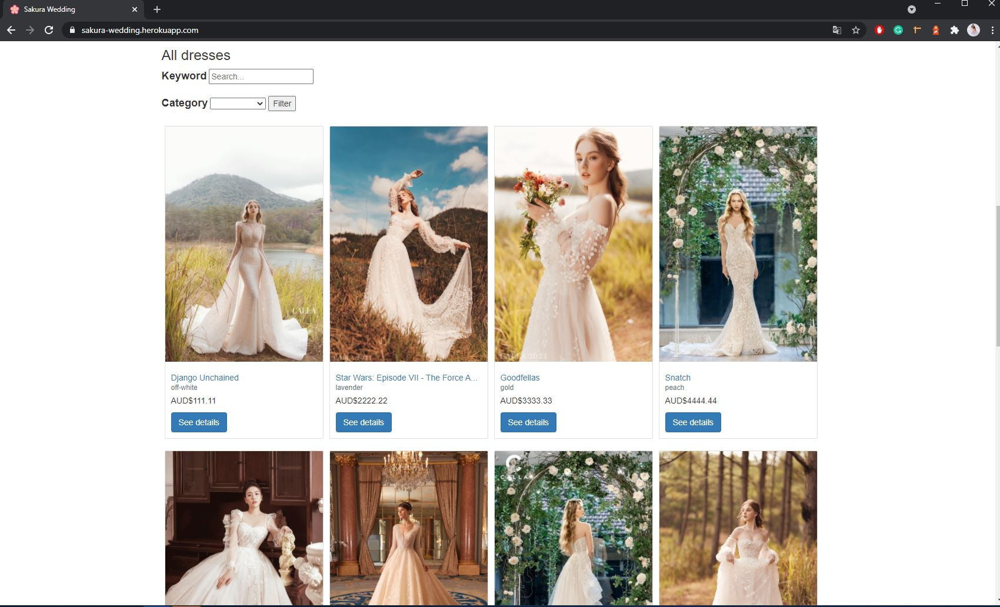
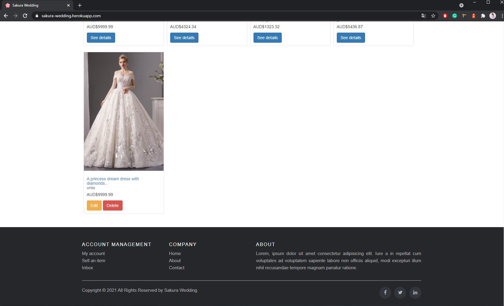

- ### Show a dress with reviews

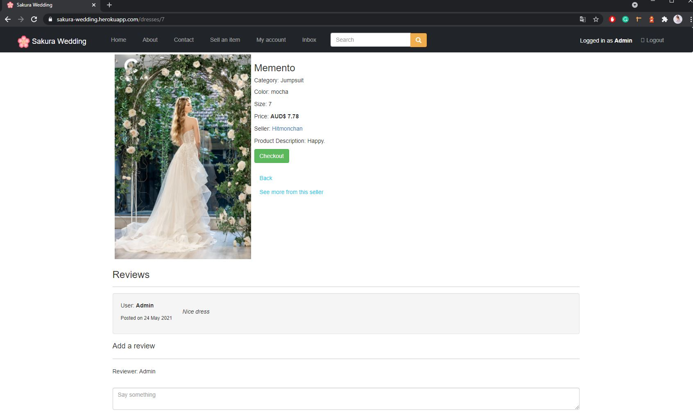

- ### List a new dress

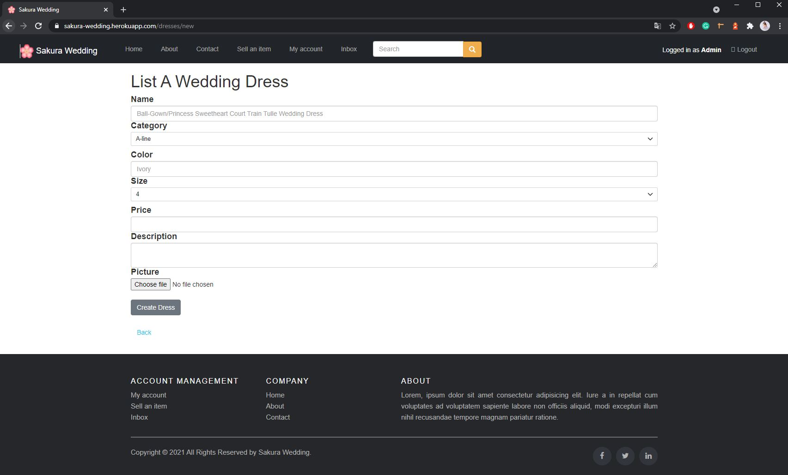

- ### My account

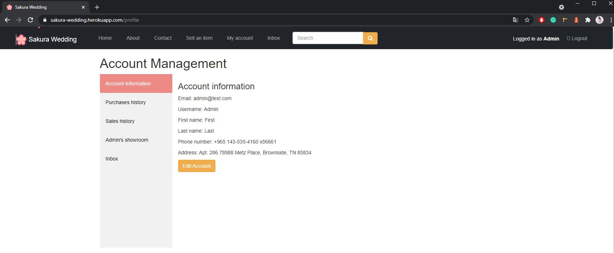

- ### All Purchases

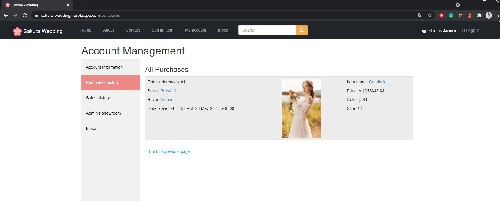

- ### All Sales

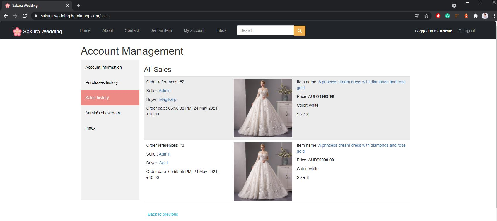

- ### Showroom

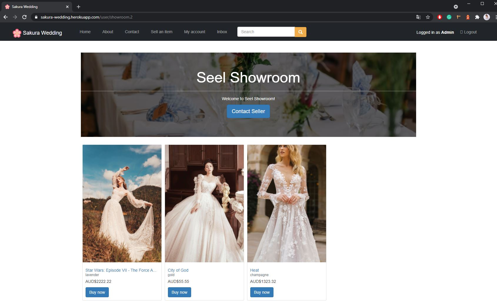

- ### Showroom reviews

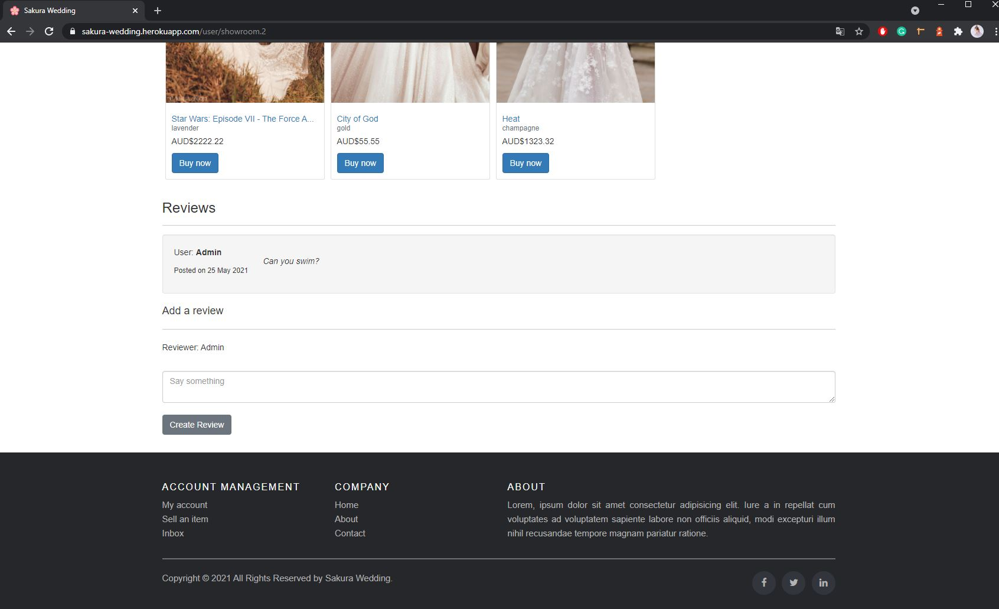

- ### Inbox

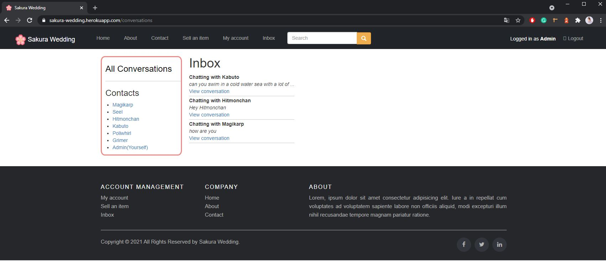
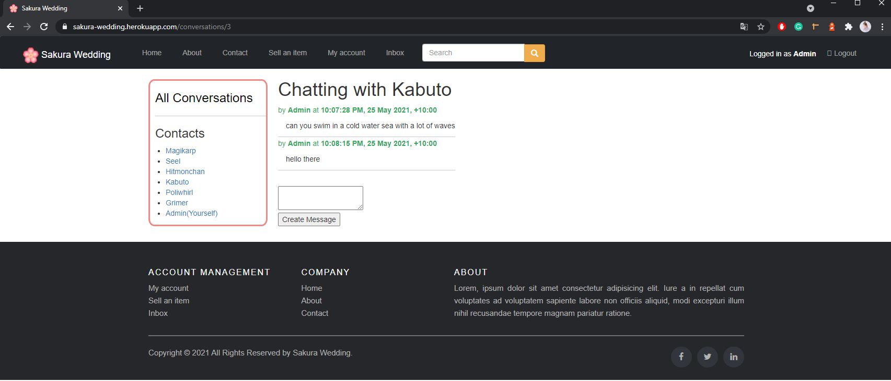

- ### Search and filter result

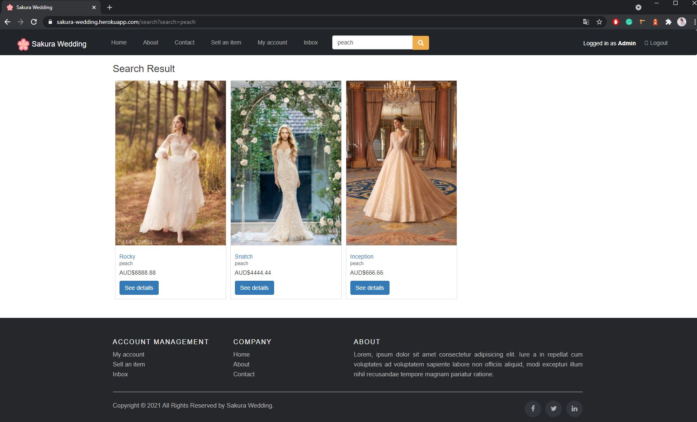
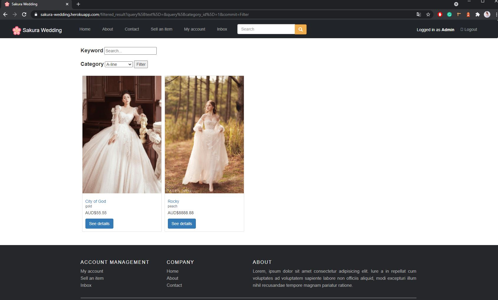

- ### Register

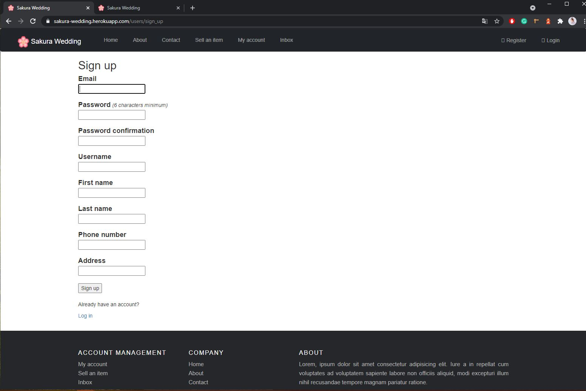

- ### About

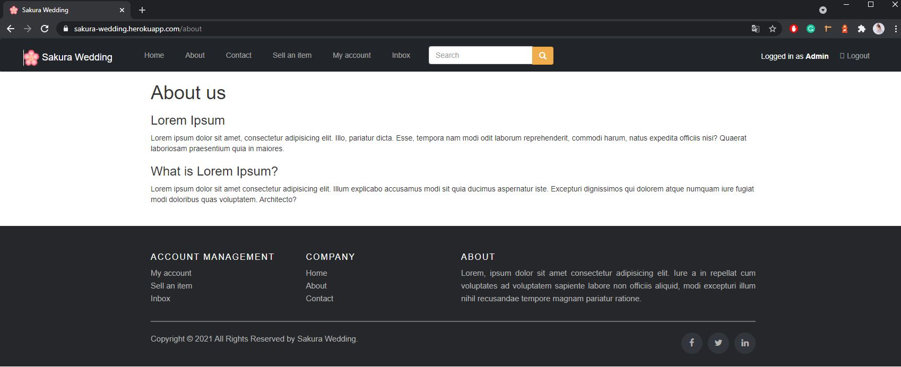

- ### Contact

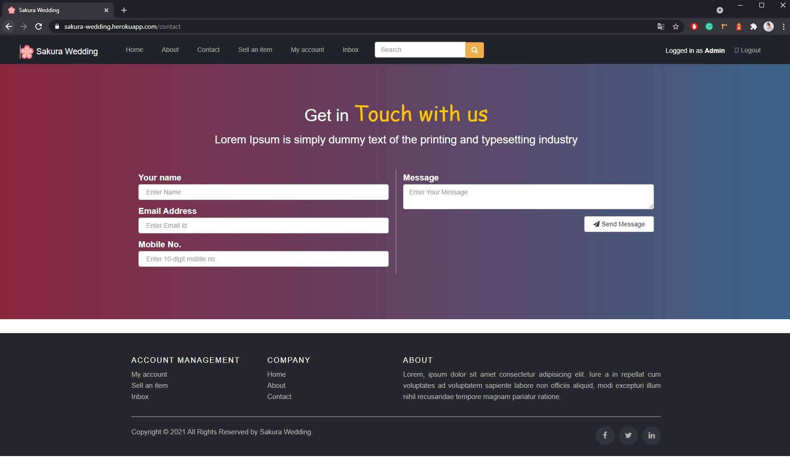

## Target audience

Clients who are interested in looking for a wedding dress at affordable prices, brand-new or used; or those who are looking around for wedding dress ideas and blogs with wedding tips.

- Bride-to-be
- Groom-to-be (who looks for a wedding dress for their fiance/wife)
- Bride's friends and family members
- Any girl who would like to have single-bride photoshoot
- SME wedding studios
- People living in low income wishing a wedding dress
- People who would like to sell their used/new wedding dress.

## Tech stack

(this application is built in WSL, there may be some unexpected technical issues when running on Mac or Windows)

    - Application 
        - Ruby 2.7.2
        - Rails 6.1.3.2
    - Ruby gems:
        - gem "rspec-rails", group: [:development, :test]
        - gem 'bootstrap-sass'
        - gem 'jquery-rails'
        - gem 'devise'
        - gem "aws-sdk-s3", "~> 1.94"
        - gem "stripe", "~> 5.32"
        - gem 'faker'
        - gem "pundit"
        - gem 'shoulda-matchers', '~> 4.0'
        - gem "pg_search"
    - Database:
        - PostgreSQL
    - Deployment server: 
        - Heroku
    - CSS Framework:
        - Bootstrap
    - Image cloud storage:
        - Amazon Web Services
    - Payment Gateway:
        - Stripe
    - Version Control:
        - Git
        - Github
    - Project Management: 
        - Trello
    - Tool to draw wireframes:
        - Figma
    - Tool to draw ERD and database tables:
        - Draw.io

> ## R12 User stories for your app

- User
    As a user, I want to sign up, so that I can have an account to buy or sell my wedding dress.

    As a user, I want to log in, so that I can make a transaction, list an item, or check my account information.

    As a user, I want to see all listings in the website, so that I have an overview of the products and the purpose of this website.

    As a user, I want to see "About Us" page, so that I know the people and the organisation behind the scene.

    As a user, I want to a look at social media channels of the company, so I have a better understanding about their marketing messages and their popularity.

    As a user, I want to click on a product from a list of cards, so that I can see more information about the item.

This is a two-sided marketplace, so users can play a role as a seller or a buyer, or both.

- Seller (User)

    As a seller, I want to list my item to sale, so that other users can see it and buy it.

    As a seller, I want to see all of my listed items, so that I have an overview of my showroom.

    As a seller, I want to update information of a listed item, so that other potential buyers can easily search, see and consider to buy my products.

    As a seller, I want to see the sold item and the order's address, so that I can ship my product to the requested address.

    As a seller, I want to message the buyer, so that I can notify them if any changes in products, out of stock, or delayed shipment.

    As a seller, I want to filter my sold items by week, by month, by year, so that I can see my revenue in that span of time.

    As a seller, I want to remove a listed item, because that product is out of stock and I won't re-stock anymore.

    As a seller, I want to contact the website's helpline, so that my concerns or questions about selling process can be answered.

    As a seller, I want to contact the website's helpline, so that my technical error, or account recovery request could be solved.

- Buyer (User)

    As a buyer, I want to filter website's listed wedding dress by: category, price, color, size, so that I can find a dress that more closely matches my demand.

    As a buyer, I want to see all products of a specific seller, because their design catches my eyes, so that I can see if they have more similar dresses to choose.

    As a buyer, I want to have a shopping cart, so that I can easily purchase items online.

    As a buyer, I want to receive an SMS or email when the item is arrived, so that I can pick up right away.

    As a buyer, I want to pay online, so that I can use my debit card or visa card to pay for my purchase.

    As a buyer, I want to message the seller, so that I can change the shipping address because I put a wrong one.

    As a buyer, I want to see my purchase history, so that I can have an overview of what I bought and who I bought from.

    As a buyer, I want to review the purchased item, so that other users can know my experience and opinion about the item to make their decision.

    As a buyer, I want to review the seller, so that other users can know if this seller is good, trustful, easy to communicate or not.

- Administrator (User)

    As an administrator, I want to have access to customer's orders and account information (except password), so that I can troubleshoot user's problems when they call the hotline for help.

    As an administrator, I want to have full control of sellers' items, so that I can add more items, edit or delete items for sellers because they may not access their account at that time.

    As an administrator, I want to have full control of sellers' items, so that I can remove items, because they are offensive/non-related/repeated.

    As an administrator, I want to message other users, so that I can provide customer service for them when they need help.

    As an administrator, I want to edit About Us and Contact page, so that I can update about our contact method and company's public information.

> ## R13 Wireframes for the apps

Wireframes are designed using Figma.com.
This website provides us a great tool to design web pages which is "pixel-perfect" with very detailed components, like components width and height with pixel, and hex color (I used the exact same hex color for most of the real page).

There are two detailed pages with 6 wireframes for 6 screensizes as below:
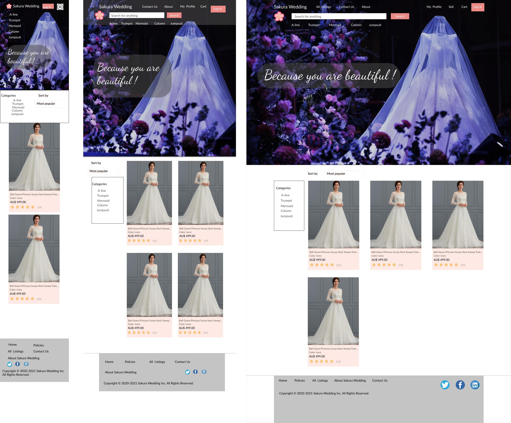
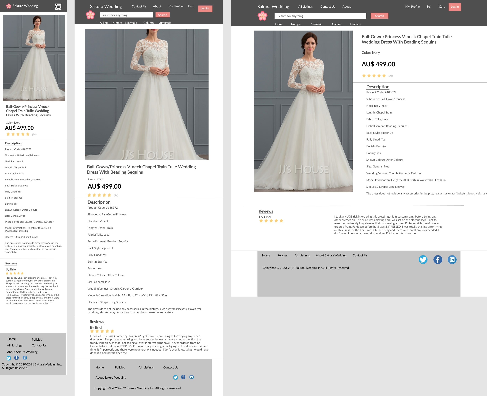

> ## R14 An ERD for your app

Below is the ERD that I created before coding, so that I have an imagination of entities and their relationships.
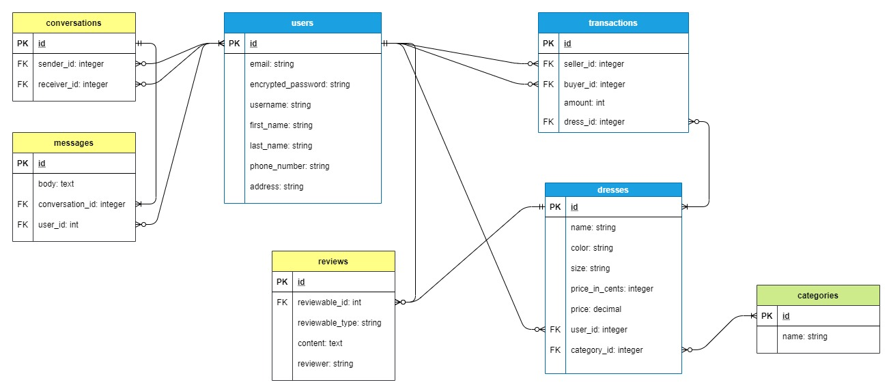

> ## R15 Explain the different high-level components (abstractions) in your app

Due to the time limit, I can build a basic MVP with some important models - which represents basic high-level components that should be included in the first version.

- `Dress`: Sakura Wedding is a marketplace for wedding dresses, so the first component is dress. Dresses listed in the website can be created, edited, deleted (to be honest, I should mark it as sold-out and they are off the marketplace, but still shown in a "sold-out list", shown in purchases history and sales history. But I didn't have enough time for it. So this function can be created in version 2). Dress can be searched or filtered in the app, which makes it much easier to find an item.
- `User`: User is anyone who browse Sakura Wedding. Users can interact with the website buy selling their item, or checkout to buy items. They can be our target end-clients, but also our staff who works on the app (administration role). Users will be authorised for what they can see and what they can do with the website. For instance, users can only see their conversations, users can edit their items, but cannot edit other seller's items. Users can chat with other users in the application. Users can create a new account(register), edit their account information.
- `Transaction`: A transaction is an order. It can be a purchase of the buyer and a sale of the seller. Transaction is created when users checkout and pay for the item. Seller can see the sale so they can ship the product to the buyer, and see all sales to estimate their revenue. Buyer can see the purchases history to see what they have bought.
- `Conversation` and `Message`: A conversation is a talk, especially an informal one, between two or more people, in which news and ideas are exchanged. In this app, the conversation is made only between two users. In each conversation, there may be one or many messages. Each message should be shown with created_time, so that we can know when this message is sent. A conversation/message will be seen by both sender and receiver. For instance, users can chat with the seller to ask more about the item, or change the buyer phone number because they put it wrong.
- `Review`: Review is very important in marketplace website. A large number of people make buying decision based on reviews and ratings. Reviews can be made for each item, and for each seller (in this app, review for each seller is at the bottom of their showroom page)

> ## R16 Detail any third party services that your app will use

Sakura Wedding utilises third party services such as Heroku, Amazon Web Services and Stripe to improve the productivity and performances.

- Heroku

Heroku is a cloud platform that lets people build, deliver, monitor and scale apps — they facilitates development process with a fast way to go from idea to URL, bypassing all those infrastructure headaches. it helps to focus on innovation and programming, not operations. The service removed friction between balancing the needs of development cycles and server maintenance and supervision. Thanks to its user-friendly and powerful dashboard, in conjunction with command line support, Sakura Wedding can be deployed from a very early stage. This allowed for continuous deployment and frequent updates to be made. Developers can sync the heroku project with Github repository, so it will be updated in sync with the Github Repo. Heroku operation and security team is instantly ready to help 24/7. If not sync with github repo, users are allowed to create a new server in just 10 seconds by using the interface of Heroku Command Line. Integration with other AWS products in quite easy, beginner and startup-friendly. They offer free and hobby package, for non-commercial apps, such as proof of concepts, MVPs, and personal projects. This package is exactly what Sakura Wedding is looking for the first version.

However, if using other packages, Heroku is said to be much pricier than using cloud providers like AWS, Azure, or Digital Ocean. It does solve a lot of Dev-Ops headaches, but may be too expensive for some companies.

- Amazon Web Services (AWS)
Amazon Web Services (AWS) is a subsidiary of Amazon providing on-demand cloud computing platforms and APIs to individuals, companies, and governments, on a metered pay-as-you-go basis. Amazon Simple Storage Service (Amazon S3) is used as a cloud storage for attached images uploaded by users to Sakura Wedding without impeding on server or database memory and storage capacities. This solution will make web-scale computing easier.

Amazon S3 has a simple web services interface which makes it easier for users to store and retrieve any amount of data, at any time, from anywhere on the web. When building Sakura Wedding, AWS helps me to store images upload from both localhost server and heroku server. Users can store an infinite amount of data in a bucket. Upload as many objects as they like into an Amazon S3 bucket. Each object can contain up to 5 TB of data. Each object is stored and retrieved using a unique developer-assigned key. Users can grant or deny access to others who want to upload or download data into their Amazon S3 bucket.

- Stripe
Stripe is an online payment processing platform that allows businesses to send and receive payments over the internet. Stripe Payments makes it easier for merchants to start and control an online business by building a set of products that could save many hours, money, and resources that are required for creating and setting up an online payment processor to start accepting online payment from customers.

Stripe allows a business to take payments from credit cards in seconds and transfer those payments directly into the business bank accounts. Stripe supports credit card payments, recurring payments, subscription billing, Apple Pay, Ali Pay, and many other payment modes.

Stripe helps Sakura Wedding dress to take care of payment of transactions. When clients click checkout, it will be redirected to Stripe payment page, where users fill in their card information or pay by Apple Pay, Ali Pay, and many other payment modes. Instructions and Documentation on using Stripe is quite straight-forward, detailed and easy to follow along.

> ## R17 Describe your projects models in terms of the relationships (active record associations) they have with each other

There are 7 models generated in Sakura Wedding application. Each relationship will be taken into account.

## 1. User & Dress

User model has "has_many" association with Dress model, because an instance of User model has zero or more instances of Dress model. In the real world, a user can list zero or many wedding dresses in the app. Due to the dependent: destroy, if a user is deleted from the database, then all their associated dresses will be deleted as well. This prevents any orphan dresses being left behind.

user.rb

```ruby
has_many :dresses, dependent: :destroy
```

On the other hand, a dress can belongs to one user only, so the relationship of Dress model with User model is "belongs_to". It is not mandatory for a user to create a new dress in the system.

dress.rb

```ruby
    belongs_to :user
```

## 2. Transaction & User &  Dress

A user can have zero or many transactions. Transactions can be either a sale of the seller or a purchase of the buyer. Both Buyer and Seller are users. So the relationship of User model to Transaction model is "has_many", and Transaction model belongs_to the user model.

A dress can be in zero or many transactions. A transaction needs to have at least one dress (in Sakura Wedding app, users can checkout one item at a time only. I haven't had enough time to build a shopping cart for multiple dresses). Therefore the Dress model is in has_many relationship with the Transaction model, and the Transaction is in belongs_to relationship with the Dress model.

I added `dependent: :destroy` to has_many relationship, for now, so that users can delete the dress if they don't want to sell it anymore, or delete their account if they wish (preventing any orphan transaction remaining).

However this is not a good idea for user experience. Dresses should be marked "sold-out" instead, because in the real world, seller still want to track their sales history for revenue summary even if the item is out of the marketplace. Buyer may still wish to see their purchases history even if the item is no longer available. Or in the future, if seller decides to restock the dress, they just need to switch the dress back to "available" mode. I didn't have enough time so I'll put this idea off until version 2.

user.rb

```ruby
    #declare relationships with the Transaction
    has_many :sales, class_name: "Transaction", foreign_key: :seller_id, dependent: :destroy 
    has_many :sold_dresses, through: :sales, source: :dress, dependent: :destroy 
    has_many :purchases, class_name: "Transaction", foreign_key: :buyer_id, dependent: :destroy 
    has_many :purchased_dresses, through: :purchases, source: :dress, dependent: :destroy 

    #give me all transactions with seller_id 
    scope :sellers, -> { joins(:sales) }
    #give me all transactions with buyer_id 
    scope :buyers, -> { joins(:purchases) }
  
```

transaction.rb

```ruby
  belongs_to :seller, class_name: "User"
  belongs_to :buyer, class_name: "User"
  belongs_to :dress
```

dress.rb

```ruby
    has_many :transactions, dependent: :destroy
```

## 3. Dress & Category

I put category in a separate model, so it can be in a separate table in the database. A dress must belong to a category ( so that users can filter by category to search for their demand), so the relationship is belongs_to. The Category model has many dresses, meaning that users can add many items to a category.

dress.rb

```ruby
    belongs_to :category
```

category.rb

```ruby
    has_many :dresses
```

## 4. Dress

A dress has one attached picture which allows user to attach a picture to a dress if they wish.

dress.rb

```ruby
    has_one_attached :picture
```

## 5. Review & User, Review & Dress

A user has zero or many reviews, a dress also has zero or many reviews. A review must belongs to either a user or a dress. Therefore, polymorphic associations are used in this case. With polymorphic associations, the Review model can belong to the User model and the Dress model. A collection of reviews can be retrieved from an instance of the Dress model or an instance of the User model: `@dress.reviews` or `@user.reviews`

review.rb

```ruby
class Review < ApplicationRecord
  belongs_to :reviewable, polymorphic: true
  validates :content, presence: true
end
```

dress.rb

```ruby
    has_many :reviews, as: :reviewable, dependent: :destroy 
```

user.rb

```ruby
  has_many :reviews, as: :reviewable, dependent: :destroy 
```

## 6. Conversation & Message, Conversation & User

The conversation model defines that a conversation belongs to a sender_id and receiver_id as foreign keys. This can be explained through the scope :between defined in the conversation model. For instance a user called Pikachu would like to chat with user Charizard because Pikachu is interested in Charizard's wedding dress, Pikachu clicks on "Inbox" button in the sitemap, then find Charizard in the contact list. When Pikachu clicks Charizard, it will redirect to chat screen with Charizard, Pikachu will be assigned as sender_id and Charizard will be assigned as receiver_id. If the role were reversed, Charizard would have sender_id and Pikachu would have receiver_id.
A conversation is shown in the "Inbox"(All conversations) only when at least one message is sent.

A conversation has many messages, each message belongs to one conversation. A message also belongs to a user because I want to show in the chat section the author of the message. The user model has "has_many" relationship with the message model.

If user is deleted, conversations and messages will be destroyed as well, so no orphan conversation or message remaining.

user.rb

```ruby
    #establish two relations for conversations
    has_many :sent_conversations, class_name: 'Conversation', foreign_key: :sender_id, dependent: :destroy
    has_many :received_conversations, class_name: 'Conversation', foreign_key: :receiver_id, dependent: :destroy

    #relation with message
    has_many :messages, dependent: :destroy
```

conversation.rb

```ruby
class Conversation < ApplicationRecord
    ...
    belongs_to :sender, class_name: 'User'
    belongs_to :receiver, class_name: 'User'

    #relationship with messages, default sorting rule is 'the oldest one comes first'
    has_many :messages, -> { order(created_at: :asc) }, dependent: :destroy
    
    #create 'participating' to use in conversations_controller, so current_user can see conversations if they are either a sender or a receiver
    scope :participating, -> (user) do
        where("(conversations.sender_id = ? OR conversations.receiver_id = ?)", user.id, user.id)
    end
    #a scope that returns a conversation for two users
    scope :between, -> (sender_id, receiver_id) do
        where(sender_id: sender_id, receiver_id: receiver_id).or(where(sender_id: receiver_id, receiver_id: sender_id)).limit(1)
    end
    ...
end
```

message.rb

```ruby
    class Message < ApplicationRecord
        validates :body, presence: true
        belongs_to :conversation
        belongs_to :user
    end
```

> ## R18 Discuss the database relations to be implemented in your application

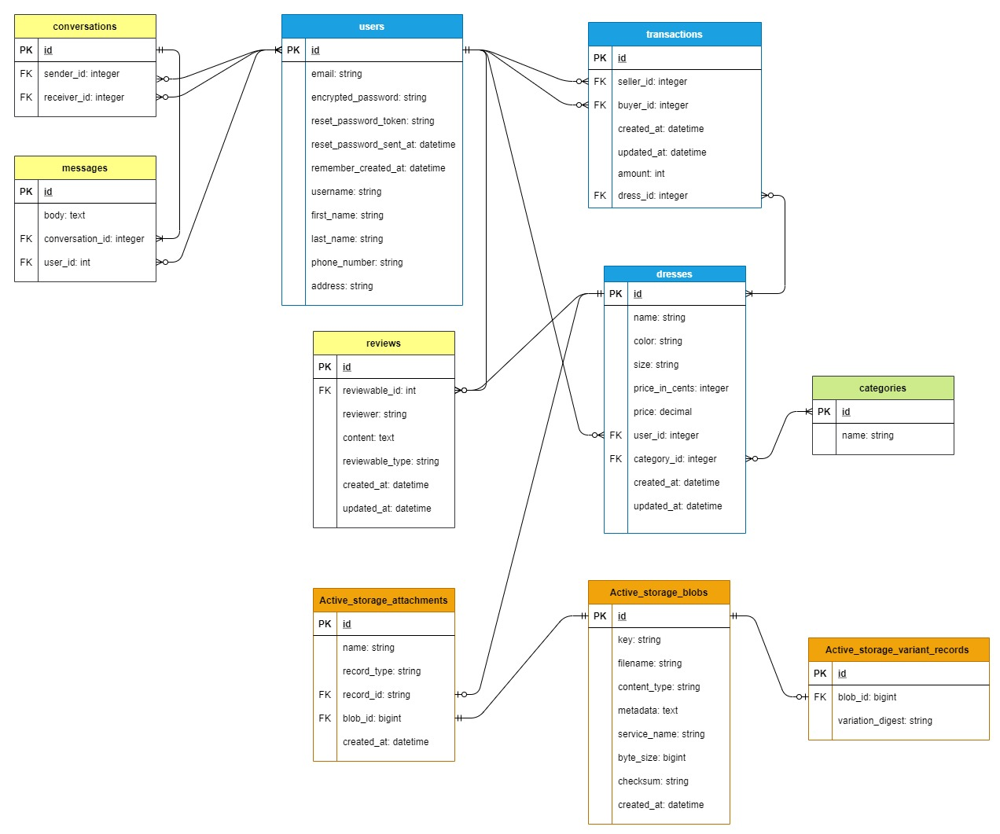

The diagram above depicts a more detailed of ERD, with addition of 3 Active Storage tables in the database. created_at and updated_at are default columns storing time and date when an item is created or updated in the data table.

## Dresses

- user_id (foreign key) - indexed field specifying who is the owner of this dress. Only the owner has the right to edit and delete the dress. Other users can only see and buy the dress.
- category_id (foreign key) - indexed field specifying which category the dress belongs to.
- name: name of the dress
- color: the color of the dress
- description: a brief description with more details about the dress, like measurements, materials, how it was made... to make it more attractive in buyer's eyes.
- price (decimal): input price from user. I suppose that this is in AUD
- price_in_cents (integer): this is a column in the system only, now showing to the users. I converted price (decimal) to price_in_cents (integer) for accurate arithmetic.

## Conversations

- sender_id – informs the database who started the conversation and indexed by that user_id
- receiver_id– indexed field specifying who is the receiver by that user_id. We will use Facebook’s conversation system as an example, so there can be only one conversation between two specific users.

## Messages

- body – the actual text of the message
- conversation_id (foreign key) – indexed field specifying the parent conversation.
user_id (foreign key) – indexed field specifying who the sender of the message.

## Transactions

Transactions table has three foreign keys.

- Seller_id (foreign key) - informs the database who is the seller of this dress and indexed by that user_id
- Buyer_id (foreign key)- indexed field specifying who is the one who bought this dress by referencing their user_id.
- amount: the value of this transaction in cents
- dress_id (foreign key)- indexed field specifying which dress is in the the transaction.

## Reviews

Reviews can be written for each user or for each dress. So I need to set the kind of generic entity this model belongs to, I call it Reviewable. This uses the method of polymorphic associations. The database representation of this polymorphism consists of two columns, which represent the ID and the type of the actual entity that our review will belong to. In our case, these columns will be reviewable_id (type: integer) and reviewable_type (type: character varying).

- reviewable_id (Foreign key) indexed field specifying which entity this review belongs to. It can be user_id, or dress_id.

I added two columns for content and reviewer:

- content: the actual text of the review
- reviewer: I set to the current_user.username

> ## R19 Provide your database schema design

```ruby
ActiveRecord::Schema.define(version: 2021_05_23_041610) do

  # These are extensions that must be enabled in order to support this database
  enable_extension "plpgsql"

  create_table "active_storage_attachments", force: :cascade do |t|
    t.string "name", null: false
    t.string "record_type", null: false
    t.bigint "record_id", null: false
    t.bigint "blob_id", null: false
    t.datetime "created_at", null: false
    t.index ["blob_id"], name: "index_active_storage_attachments_on_blob_id"
    t.index ["record_type", "record_id", "name", "blob_id"], name: "index_active_storage_attachments_uniqueness", unique: true
  end

  create_table "active_storage_blobs", force: :cascade do |t|
    t.string "key", null: false
    t.string "filename", null: false
    t.string "content_type"
    t.text "metadata"
    t.string "service_name", null: false
    t.bigint "byte_size", null: false
    t.string "checksum", null: false
    t.datetime "created_at", null: false
    t.index ["key"], name: "index_active_storage_blobs_on_key", unique: true
  end

  create_table "active_storage_variant_records", force: :cascade do |t|
    t.bigint "blob_id", null: false
    t.string "variation_digest", null: false
    t.index ["blob_id", "variation_digest"], name: "index_active_storage_variant_records_uniqueness", unique: true
  end

  create_table "categories", force: :cascade do |t|
    t.string "name"
    t.datetime "created_at", precision: 6, null: false
    t.datetime "updated_at", precision: 6, null: false
  end

  create_table "conversations", force: :cascade do |t|
    t.bigint "sender_id", null: false
    t.bigint "receiver_id", null: false
    t.datetime "created_at", precision: 6, null: false
    t.datetime "updated_at", precision: 6, null: false
    t.index ["receiver_id"], name: "index_conversations_on_receiver_id"
    t.index ["sender_id"], name: "index_conversations_on_sender_id"
  end

  create_table "dresses", force: :cascade do |t|
    t.string "name", null: false
    t.string "color"
    t.string "size"
    t.text "description"
    t.decimal "price", precision: 10, scale: 2
    t.datetime "created_at", precision: 6, null: false
    t.datetime "updated_at", precision: 6, null: false
    t.bigint "category_id", null: false
    t.bigint "user_id", null: false
    t.integer "price_in_cents"
    t.index ["category_id"], name: "index_dresses_on_category_id"
    t.index ["user_id"], name: "index_dresses_on_user_id"
  end

  create_table "messages", force: :cascade do |t|
    t.text "body"
    t.bigint "conversation_id", null: false
    t.bigint "user_id", null: false
    t.datetime "created_at", precision: 6, null: false
    t.datetime "updated_at", precision: 6, null: false
    t.index ["conversation_id"], name: "index_messages_on_conversation_id"
    t.index ["user_id"], name: "index_messages_on_user_id"
  end

  create_table "reviews", force: :cascade do |t|
    t.string "reviewer"
    t.text "content"
    t.string "reviewable_type", null: false
    t.bigint "reviewable_id", null: false
    t.datetime "created_at", precision: 6, null: false
    t.datetime "updated_at", precision: 6, null: false
    t.index ["reviewable_type", "reviewable_id"], name: "index_reviews_on_reviewable"
  end

  create_table "transactions", force: :cascade do |t|
    t.bigint "seller_id", null: false
    t.bigint "buyer_id", null: false
    t.bigint "dress_id", null: false
    t.integer "amount", default: 0
    t.datetime "created_at", precision: 6, null: false
    t.datetime "updated_at", precision: 6, null: false
    t.index ["buyer_id"], name: "index_transactions_on_buyer_id"
    t.index ["dress_id"], name: "index_transactions_on_dress_id"
    t.index ["seller_id"], name: "index_transactions_on_seller_id"
  end

  create_table "users", force: :cascade do |t|
    t.string "email", default: "", null: false
    t.string "encrypted_password", default: "", null: false
    t.string "reset_password_token"
    t.datetime "reset_password_sent_at"
    t.datetime "remember_created_at"
    t.datetime "created_at", precision: 6, null: false
    t.datetime "updated_at", precision: 6, null: false
    t.string "username", null: false
    t.string "first_name"
    t.string "last_name"
    t.string "phone_number"
    t.string "address"
    t.index ["email"], name: "index_users_on_email", unique: true
    t.index ["reset_password_token"], name: "index_users_on_reset_password_token", unique: true
  end

  add_foreign_key "active_storage_attachments", "active_storage_blobs", column: "blob_id"
  add_foreign_key "active_storage_variant_records", "active_storage_blobs", column: "blob_id"
  add_foreign_key "conversations", "users", column: "receiver_id"
  add_foreign_key "conversations", "users", column: "sender_id"
  add_foreign_key "dresses", "categories"
  add_foreign_key "dresses", "users"
  add_foreign_key "messages", "conversations"
  add_foreign_key "messages", "users"
  add_foreign_key "transactions", "dresses"
  add_foreign_key "transactions", "users", column: "buyer_id"
  add_foreign_key "transactions", "users", column: "seller_id"
end
```

> ## R20 Describe the way tasks are allocated and tracked in your project

Trello link: <https://trello.com/b/wOzMr9ub/wedding-dress-market>

There are three main parts of this assignment: the program, the README documentation and the Slide deck. Therefore I put requirements for those parts in separate sections. I used Trello to plan and track my working process, so that I know exactly what I am doing, what are the backlogs, what are the errors and Rubic requirements for each parts.

Trello is a powerful tool that can work as a personal to do list or a powerful project management system to coordinate and assign tasks to everyone in a company. It can make light work of organizing my projects, but it can take a little bit to get up to speed.
I created some labels which are super useful to visually quickly keep track of the project:

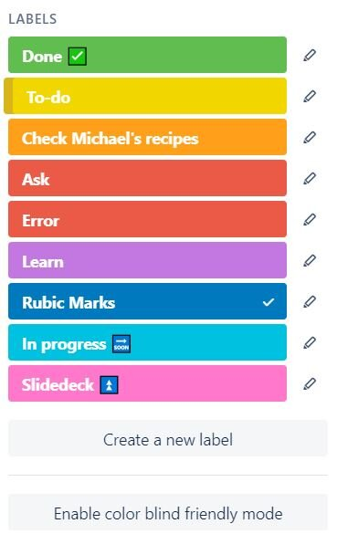

There are six columns in my Trello Board:

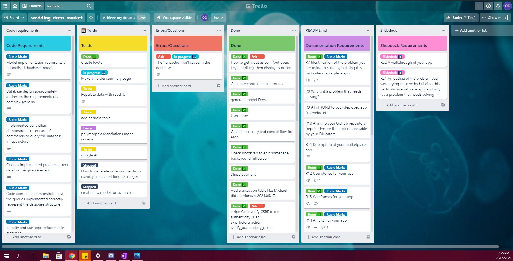

1. Code requirements:
    I created cards with all requirements about the coding part of the assignment. I also check the Rubic and copy relevant instruction to the content of the cards, respectively, and labeled them "Rubic Marks" if that requirement is detailed in the Rubic.
    If that requirement for the code is satisfied, I will label them as "Done", so that I can skip this part and focus on other coding parts.
2. To-do (for coding tasks):
    This is very important column in my Trello Board. I divided my coding tasks into many small tasks, labeled them as "Learn" if I need further investigation before coding, or label "To-do" if I know how I should do it and will start coding it soon one by one, or label "In-progress" if that task is complicated and I haven't finished yet.

    If the task is finished, I will label them as "Done" and move the card to "Done" Column.
3. Error/Questions:
    During the coding period, if there is any error that I cannot fix it, or need more time to fix it, I will create a card in this list to record the error, and then ask my teacher for help, or spend more time to investigate the solution. If it is solved, I will take a brief explanation, or put a link to the solution, then label as "Done" and move the card to "Done" column. I still keep the "error" label for the card, so that later on when looking back, I can recall that I had this problem before, and how I solved it.

    If I have any difficulties that need for assistant urgently, I will create a card in this list with label "Ask" to follow up with the answer process.
4. Done:
    This column is where I put all of my finished coding tasks or solved errors.
5. README.md - Documentation Requirements
    I put all documentation requirements from the assignment in Canvas in this column. Each requirement is put in a card. If that requirement is specially detailed in the rubic, I will copy rubic instruction to the description of the card and label as "Rubic Marks".

    In this way, I can easily follow closely with assignment's requirements. If a task is done, I will add a label "Done" to it, so I can focus on other tasks.
6. Slide deck
    I created two cards, each is the requirement for the Slide deck from Canva. If I finish a task, I will mark as "Done" and do the next.

    In every morning, I will have a look at Trello Board to have an overview of my task for the day, what needs to be done, which cards haven't been labelled "Done" yet, so I will have to create more specific "To-do" cards in column "To-do", and finish them before deadline.

    In this way, I can keep track of planning and development process.

> ## What's next?

There are many things I would like to do to improve the Sakura Wedding.

- Add inventory to manage stock
- Shopping cart
- Find a new third party payment and how to get successful payment notification.
- Shipping address form before paying.
- Disable delete function of dress. It should be marked as sold-out instead and out of the listings. So that is still shown in purchases and sales history.
- Blog with wedding tips
- Link with tailors to fix the dress (create a section where users can search for tailors in the area who can fix the dress- I know many tailors they only do part-time at home, no stores or branding)
- Attach many pictures from many angles => buyers can have more info to buying decision
- Notifications: There should be notification in the system and send to user's email as well, whenever an item is purchased/sold, or they receive a message from other users.
